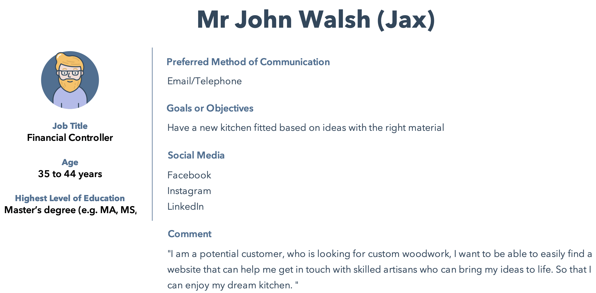
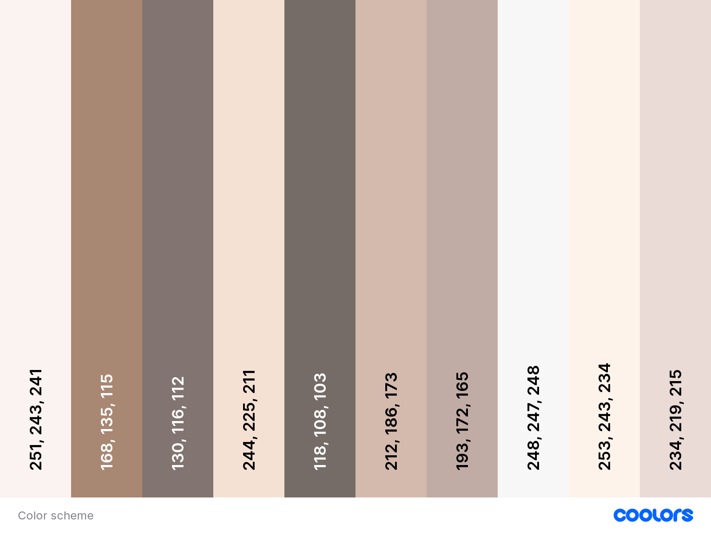
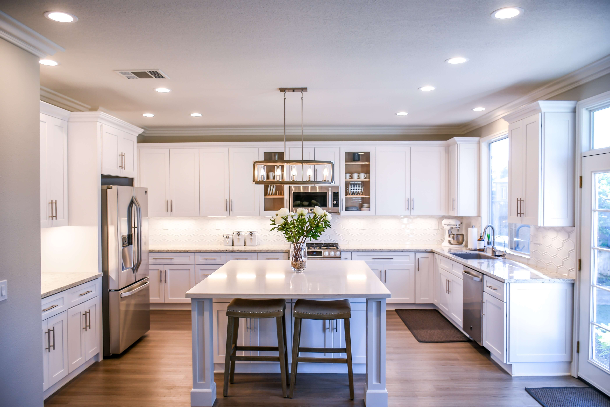
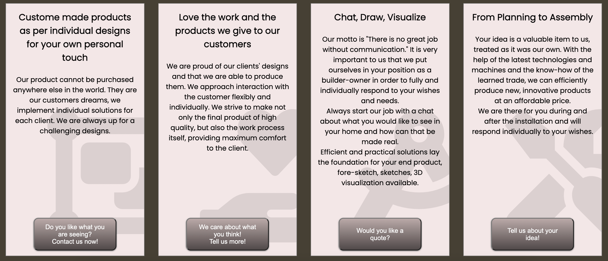
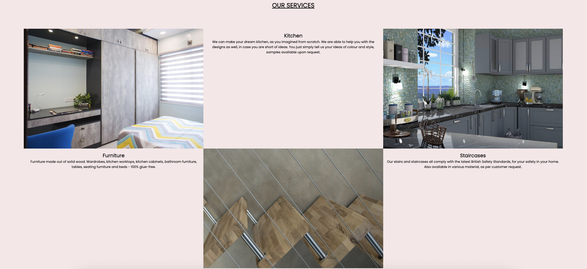
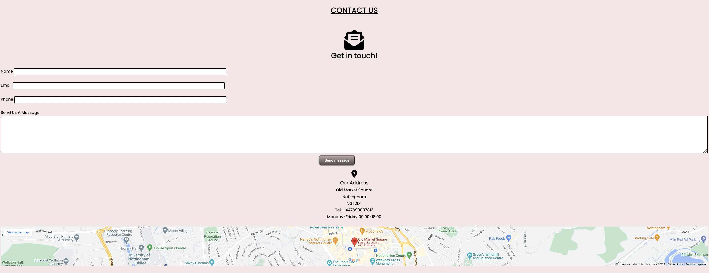

# **ApplePie Joinery**

ApplePie Joinery is a website that is designed for users who are looking for custom made woodwork/joinery work to be done (eg: their dream kitchen, wardrobe, any kind of ideas involving wood). 
The goal is to reach out to people who are potential customers and create the most enjoyable user experience while surfing on the website. Helping users to go from the Enquiry stage through to Assembly, while make it easy even for the users who are not the most familiar with computer use. 

You can view the live site here - <a href="https://norapdev.github.io/ApplePieJoinery/" target="_blank" rel="noopener">ApplePie Joinery</a>

## Table of contents
1. [**Planning Stage**](#planning-stage)
1. [**Features Common to all Pages**](#features-common-to-all-pages)
1. [**Features on Individual Pages**](#features-on-individual-pages)
1. [**Future Features to be Added**](#future-features-to-be-added)
1. [**Testing**](#testing)
1. [**Bugs**](#bugs)
1. [**Other Changes**](#other-changes)
1. [**Deployment**](#deployment)
1. [**Technology Used**](#technology-used)
1. [**Credits**](#credits)

## **Planning Stage**

### **Target Audience**
* Created 3 target personas, to see if the website is suitable for all needs

 
 
 

* Charlotte is a young university student with a tech knowledge. She is after a quick quote for her parents, which is available from the website, as there is a possibility to send a quick message straight away as an inquiry, or get on Facebook, Instagram, Twitter, YouTube, since she is present on all social media platforms. She is also using the website from her phone, which is possible, since the media queries are in place and working. 

* John is a professional, who has his own ideas about his new kitchen. He can find the website easily with the tight keywords in Google and make his dream kitchen come true in one click in the enquiry section.

* Linda is a homeowner, retired, enjoying her life, but not very comfortable with using her PC or the internet. She needs the website to be very user friendly, also easy to search and look through. She also needs an easy enquiry option, as she prefers picking up the phone, so the Contact Us section needs to be visible straight on the top. 

### **Wireframe**
The initial idea of the website was created in Balsamiq, to help me guide through the building stage as the different features have been added. 
As the website became more and more visually attractive, it was clear that some features were missing, therefore I had to make some additional implementations, for it to be user friendly and better from a sales perspectives.

Links
* [Home](assets/photos/home.png)
* [Services](assets/photos/services.png)
* [References](assets/photos/references.png)
* [Contact Us](assets/photos/contactus.png)

### **Colour Scheme**
Initially I chose the colors to be true to the main welcome picture using only my own eyes as a judge, however later on I used the below colour scheme to help with the right contrasts and shades. 
In my opinion this color being a pastel colour scheme is not too aggressive for a user, therefore it is comfortable on the eyes. 
I wanted the website to be easily readable and color blind friendly as well.

 * Colour scheme used
 

## **Features Common to all Pages**
### **Welcome Image**

* A photo of a kitchen with nice pastel colours to be easy on the eyes and also catch attention, it determines the colour scheme for the whole website

### **Navigation Bar**

 * Located at the top, always visible throughout the whole surfing experience to be able to quickly change between pages
 * A hover effect is implemented to the links to highlight where we are, but also to be a little eyecatching

 ### **Footer**

 * Located at the bottom of the page
 * The colour of the footer is completely inline with the colour of the website, so it is not taking away the user's attention to much, but the icons are very much distinvtive and clearly showing where the link will take us
 * The footer has links to Facebook, Instagram, Twitter and YouTube pages

 ## **Features on Individual Pages**
 ### **Welcome**
 
* This section welcomes the user to the website with a brief overview about the content

### **Home**

 * The Home section is created to introduce the purpose of the joinery website. 
 * The user can see the benefits of chosing ApplePie Joinery, also the distinctions that make this joinery company unique.
 * Each unique skill has its own cardbox section with a relevant icon at the background, to be more catchy.
 * Every cardbox section has a button at the bottom as well, which takes theh user to the Contact Us page immediately, so if the user decide at this stage to get a quote, it is possible straight away.

 ### **Services**

 * The Services section is created to show the strengths of ApplePie Joinery, to help users see if this is the company they are looking for
 * There are some reference photos included at this section already along with the text content.

### **References**

* This section has photos of some of the joinery's recent works
* The reference section has the most value probably, as this is how the company can show exactly what they are capable of, therefore the customer can decide whether or not this is for them

### **Contact Us**

* This section is the most important section on the website, as the customer can make contact and business can happen.
* It is possible to send a message, but also to use the other contact details there, eg: to make a phone call during the mentioned opening hours.
