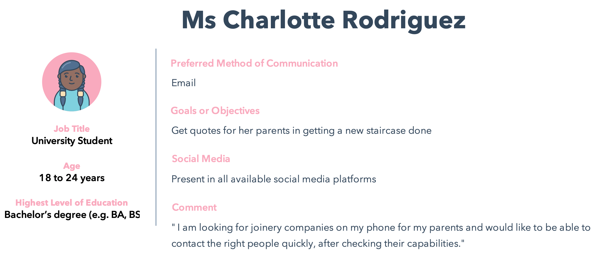
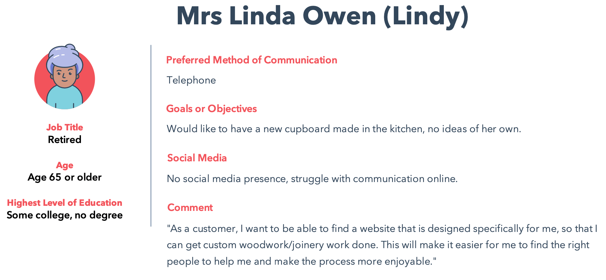
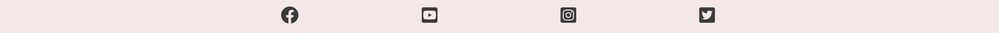
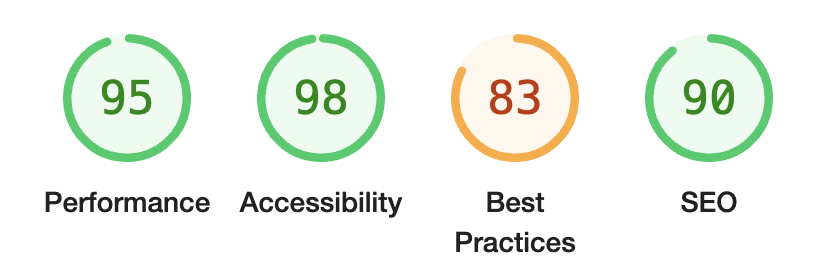
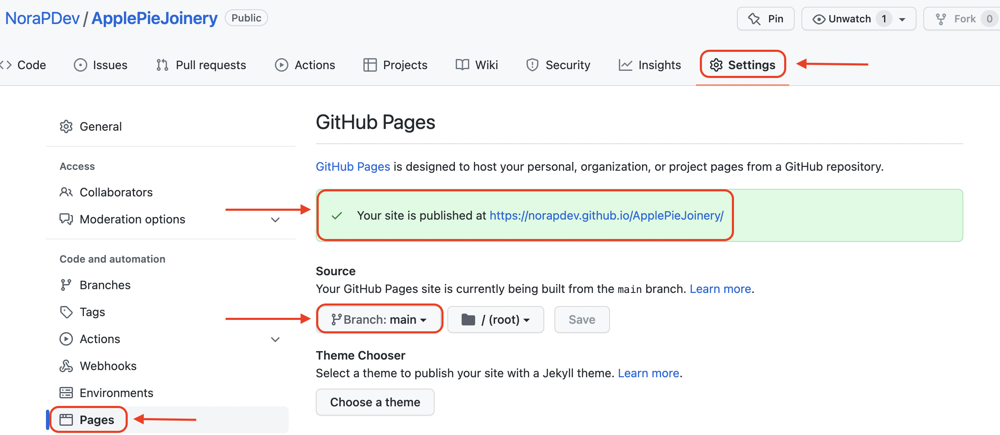
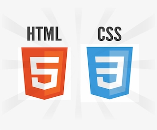

# **ApplePie Joinery**

ApplePie Joinery is a website that is designed for users who are looking for custom made woodwork/joinery work to be done (eg: their dream kitchen, wardrobe, any kind of ideas involving wood). 
The goal is to reach out to people who are potential customers and create the most enjoyable user experience while surfing on the website. Helping users to go from the Enquiry stage through to Assembly, while make it easy even for the users who are not the most familiar with computer use. 

You can view the live site here - <a href="https://norapdev.github.io/ApplePieJoinery/" target="_blank" rel="noopener">ApplePie Joinery</a>

## Table of contents
1. [**Planning Stage**](#planning-stage)
1. [**Features Common to all Pages**](#features-common-to-all-pages)
1. [**Features on Individual Pages**](#features-on-individual-pages)
1. [**Future Features to be Added**](#future-features-to-be-added)
1. [**Testing**](#testing)
1. [**Deployment**](#deployment)
1. [**Technology Used**](#technology-used)
1. [**Credits**](#credits)

## **Planning Stage**

### **Target Audience**
* Created 3 target personas, to see if the website is suitable for all needs

 
 
 

* Charlotte is a young university student with a tech knowledge. She is after a quick quote for her parents, which is available from the website, as there is a possibility to send a quick message straight away as an inquiry, or get on Facebook, Instagram, Twitter, YouTube, since she is present on all social media platforms. She is also using the website from her phone, which is possible, since the media queries are in place and working. Charlotte being young, would enjoy the animated welcome page and hovering effects, as it is a selling point for users, who are after fancy looking web designs.

* John is a professional, who has his own ideas about his new kitchen. He can find the website easily with the right keywords in Google and make his dream kitchen come true in one click in the enquiry section.

* Linda is a homeowner, retired, enjoying her life, but not very comfortable with using her PC or the internet. She needs the website to be very user friendly, also easy to search, look through and easily visible. She also needs an easy enquiry option, as she prefers picking up the phone, so the Contact Us section needs to be visible straight on the top. 

### **User Stories**
* As a user, I want to see a pure and clean site with a design that is comfortable to look at.
* As a user, I want to be able learn about the company and what they can offer, so I can decide easily.
* As a user, I want to be able to search for the different services they are capable of.
* As a user, I want to be able to see reference photos, so I can see exactly what the company made previously for other users.
* As a user, I want to be able to contact the company quickly and instantly.
* As a user, I want to be able to make a request for a quotation the most convenient and painless way.
* As a user, I want to be able to decide how to contact the company, via email, telephone or social media.

### **Wireframe**
The initial idea of the website was created in Balsamiq, to help me guide through the building stage as the different features have been added. 
As the website became more and more visually attractive, it was clear that some features were missing, therefore I had to make some additional implementations, for it to be user friendly and better from a sales perspectives.

Links
* [Home](assets/photos/home.png)
* [Services](assets/photos/services.png)
* [References](assets/photos/references.png)
* [Contact Us](assets/photos/contactus.png)

### **Colour Scheme and Font Choice**
Initially I chose the colors to be true to the main welcome picture using only my own eyes as a judge, however later on I used the below colour scheme to help with the right contrasts and shades. 
In my opinion this color being a pastel colour scheme is not too aggressive for a user, therefore it is comfortable on the eyes. 
I wanted the website to be easily readable and color blind friendly as well.

 * Colour scheme used
 

 I have chosen Poppins font from Google Fonts as I believe is it a clean and readable font type, even with a colourful background or hover effect.

## **Features Common to all Pages**
### **Welcome Image**

* A photo of a kitchen with nice pastel colours to be easy on the eyes and also catch attention, it determines the colour scheme for the whole website

### **Navigation Bar**

 * Located at the top, always visible throughout the whole surfing experience to be able to quickly change between pages
 * A hover effect is implemented to the links to highlight where we are, but also to be a little eyecatching

 ### **Footer**

 * Located at the bottom of the page
 * The colour of the footer is completely inline with the colour of the website, so it is not taking away the user's attention to much, but the icons are very much distinvtive and clearly showing where the link will take us
 * The footer has links to Facebook, Instagram, Twitter and YouTube pages

 ## **Features on Individual Pages**
 ### **Welcome**
 
* This section welcomes the user to the website with a brief overview about the content

### **Home**

 * The Home section is created to introduce the purpose of the joinery website. 
 * The user can see the benefits of chosing ApplePie Joinery, also the distinctions that make this joinery company unique.
 * Each unique skill has its own cardbox section with a relevant icon at the background, to be more catchy.
 * Every cardbox section has a button at the bottom as well, which takes theh user to the Contact Us page immediately, so if the user decide at this stage to get a quote, it is possible straight away.

 ### **Services**

 * The Services section is created to show the strengths of ApplePie Joinery, to help users see if this is the company they are looking for
 * There are some reference photos included at this section already along with the text content.

### **References**

* This section has photos of some of the joinery's recent works
* The reference section has the most value probably, as this is how the company can show exactly what they are capable of, therefore the customer can decide whether or not this is for them

### **Contact Us**

* This section is the most important section on the website, as the customer can make contact and business can happen.
* It is possible to send a message, but also to use the other contact details there, eg: to make a phone call during the mentioned opening hours.

## **Future Features to be Added**
The website still needs some improvements and additional features:
* A login page, with an additional database to store the quotes for customers, so regular customers can keep track of their requests
* Video chat function
* An affiliate links page to any subcontractor, raw material supplier
* Customer review section

## **Testing**

### **Code Validation**

* I have tested the website on a number of browsers and devices both manually and using the tools below.
The codes are all validated by [W3C HTML Validator](https://validator.w3.org/) and [W3C CSS Validator](https://jigsaw.w3.org/css-validator/). A minor warning and errors were found on the index.html when tested, but I have managed to fix them immeditately.  

### **Lighthouse Testing**

### **Site Contrast Testing**

#### **WCAG Report**

* I have tested the site with [WCAG](https://chrome.google.com/webstore/detail/wcag-color-contrast-check/plnahcmalebffmaghcpcmpaciebdhgdf?hl=en) for any color blindness issues or contrast issues. The test is showing one contrast issue with the contact buttons on the cardboxes.

## **Deployment**
I have followed the steps below for deployment:

1. Find the correct repository on GitHub
1. On the repository site, click on **Settings**
1. There is a menu on the left, click on **Pages**
1. Under the source section, change the **Branch** type to **main** and then click **Save**
1. The section above will indicate that the site is ready to be published and then it will change to **published**.

## **Technology Used**

I have used HTML5 and CSS3 to build this website. 

**HTML5**
Used to add content and structure to the website

**CSS3** 
Used to add style to the content

## **Credits**

### **Content**
* The text was mainly formed by me and the real joinery friend of mine, Tibor Bari, but also used a few technical terms and ideas from the sites below:

    *[Russian joinery company specialised in kitchens](https://www.tvoytseh.ru)
    
    *[Barr Joinery](https://www.barrjoinery.co.uk)

    *[lindauer](https://www.lindauerag.ch)

    *[Luxury Door Solutions](https://d0nni387.github.io/Luxury-Door-Solutions)

* The inspirations behind the Readme template:

    *https://github.com/gibbo101/flukey-feathers-badminton/blob/main/README.md

    *https://github.com/Elvira-94/natural-clean/blob/main/README.md

* As this is my first project in HTML and CSS, it was influenced by the study material as well, namely the Love Running project from Code Institute material.
* I have also used Google, W3 school, YouTube to get more understanding on specific areas.
* Icons used are from [Font Awesome](https://fontawesome.com/)

### **Media**
* Unfortunately none of the photos are real, they have been provided by [Pixabay](https://www.pixabay.com) and [Pexels](https://www.pexels.com/).

### **Thanks**
* I would like to say thank you to my mentor, Richard Wells, who supported me throughout this project very patiently.
* I also would like to thank you to my friend, Zoltan Siegl, for his help and support.